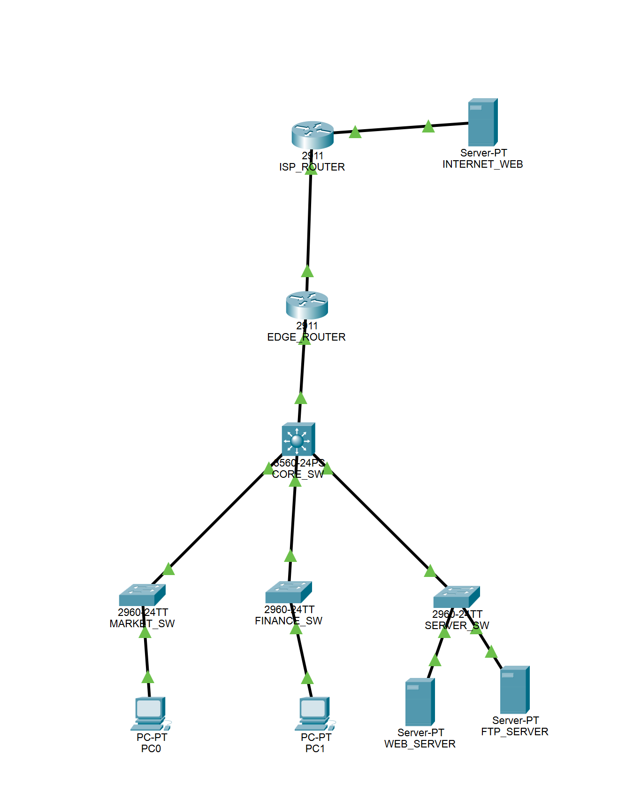
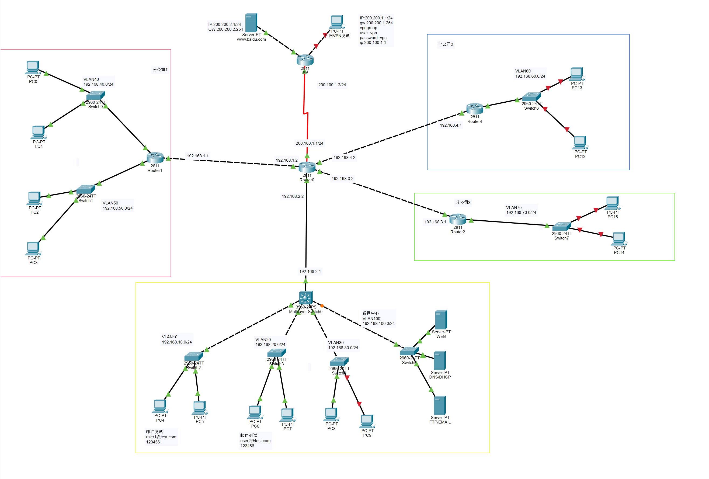

# 计算机网络课程设计 — 题目二

**Small-to-Medium Enterprise Network Planning & Design**
同济大学-计算机网络课程设计-2023级

| Item | Detail |
|------|--------|
| Course | Computer Network Course Design (计算机网络课程设计) |
| Topic | Topic 2: SME Network Planning and Design |
| Simulator | Cisco Packet Tracer 7.3 |
| Architecture | Hub-and-Spoke |
| Team | 庄子硕 (2350998) · 何东峻 (2350988) · 张云夏 (2353598) |
| Instructor | 田春岐 |

---

## Project Overview

This project designs and simulates a complete enterprise network for a mid-sized company with:

- **HQ**: ~1000 PCs across 7 departments (Marketing, Finance, HR, R&D, Admin, Operations, Customer Service)
- **3 branch offices** in remote provinces, connected to HQ via IPSec VPN over a simulated ISP
- **Public-facing services**: HTTP (web), anonymous FTP, and email — all behind NAT
- **Internal OA system** accessible only to authenticated employees, including remote workers via VPN

## Network Technologies

| Technology | Purpose |
|---|---|
| **VLAN** | Isolate each department into its own broadcast domain |
| **RIPv2** | Dynamic routing between HQ, branches, and ISP |
| **IPSec VPN (Site-to-Site)** | Encrypted tunnels from HQ to each branch office |
| **IPSec VPN (Remote Access)** | Secure dial-in for remote employees |
| **NAT / PAT** | Share a single public IP for all outbound internet traffic |
| **DHCP** | Automatic IP assignment per VLAN |
| **ACL** | Department-level access control (e.g. block Finance VLAN from other departments; restrict FTP to internal only) |
| **STP** | Prevent L2 loops in the switched core |

## Network Topology

The topology uses a central HQ router as the hub, with serial links to an ISP and three spoke branch routers.

**V1 topology** (initial design):



**V2 topology** (final design, adds remote-access VPN):



## Repository Structure

```
.
├── reports/
│   ├── assets/
│   │   ├── v1/          # V1 screenshots & Packet Tracer file (.pkt)
│   │   └── v2/          # V2 screenshots & Packet Tracer file (.pkt)
│   ├── 计算机网络课程设计_题目二_报告.pdf      # V1 report (PDF)
│   ├── 计算机网络课程设计_题目二_报告_V2.pdf   # V2 report (PDF)
│   └── 计算机网络课程设计_题目二_报告_V2.tex   # V2 report (LaTeX source)
├── Course_Design.zip                          # Full project archive
└── 计算机网络课程设计_题目列表.doc             # Topic list
```

> `Reference/` and `CiscoPacketTracer-7.3.0/` are excluded from version control via `.gitignore`.

## Key Design Decisions

**V1 → V2 changes:**
- Added **remote-access VPN** support so off-site employees can securely reach the internal OA system
- Consolidated DHCP and DNS onto a single server (192.168.80.50) to reduce complexity
- Refined ACL rules for tighter FTP and inter-VLAN access control

**IP address plan summary:**

| Segment | Range |
|---|---|
| HQ VLANs | 192.168.10.0/24 – 192.168.80.0/24 (one /24 per dept) |
| Branch offices | 10.x.x.0/24 |
| Public servers (DMZ) | 172.16.x.x |
| DHCP / DNS server | 192.168.80.50 |

## Verification Screenshots (V2)

| Feature | Screenshot |
|---|---|
| DHCP address allocation | `reports/assets/v2/dhcp_allocate_ip.png` |
| Intra-VLAN communication | `reports/assets/v2/inside_vlan_free.png` |
| Inter-VLAN (controlled) | `reports/assets/v2/between_vlan_between_comp_control.png` |
| Internet access | `reports/assets/v2/internet_funciton.png` |
| FTP service | `reports/assets/v2/ftp_function.png` |
| Email service | `reports/assets/v2/email_function.png` |
| VPN tunnel establishment | `reports/assets/v2/vpn_connect_establish.png` |
| Ping through VPN | `reports/assets/v2/vpn_connect_ping_succcess.png` |
| Ping to VPN server (internal) | `reports/assets/v2/inner_ping_vpn_server_success.png` |

## How to Open the Simulation

1. Install **Cisco Packet Tracer 7.3** (or later).
2. Open `reports/assets/v2/计算机网络课程设计_题目二_拓扑图_V2.pkt`.
3. Use simulation mode to step through ICMP / TCP flows and verify connectivity.
